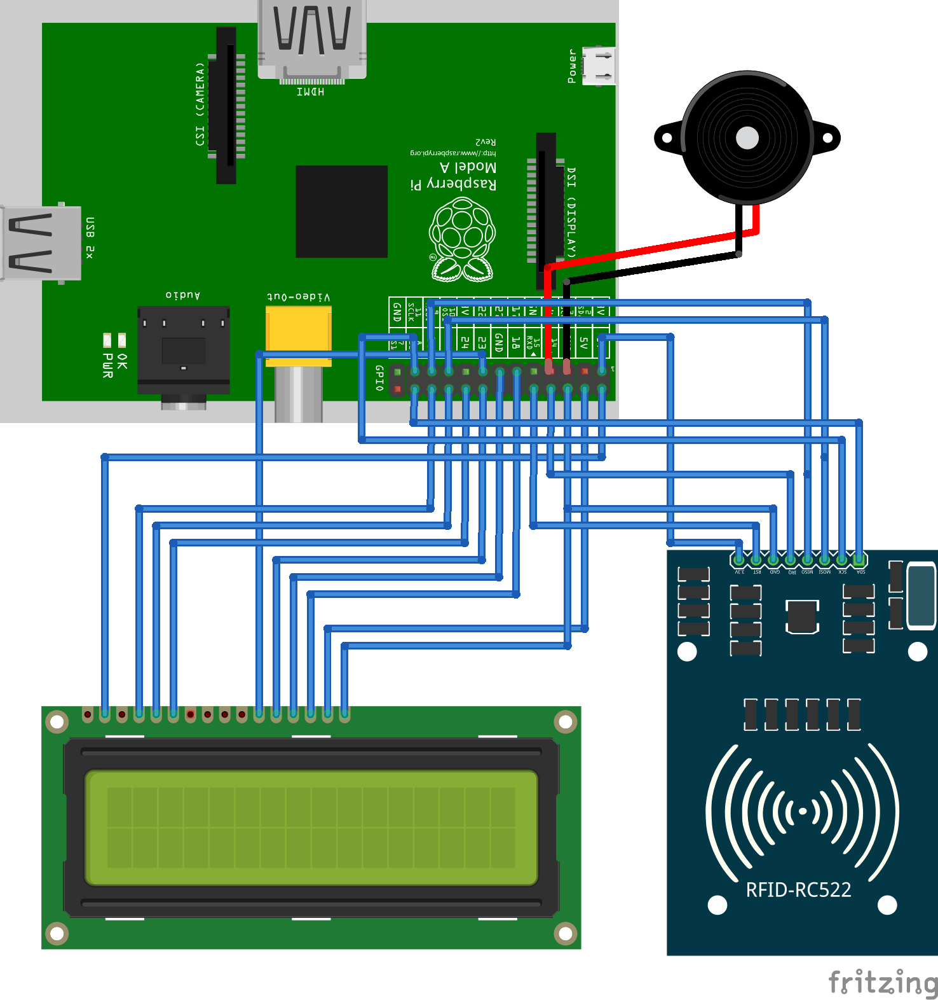
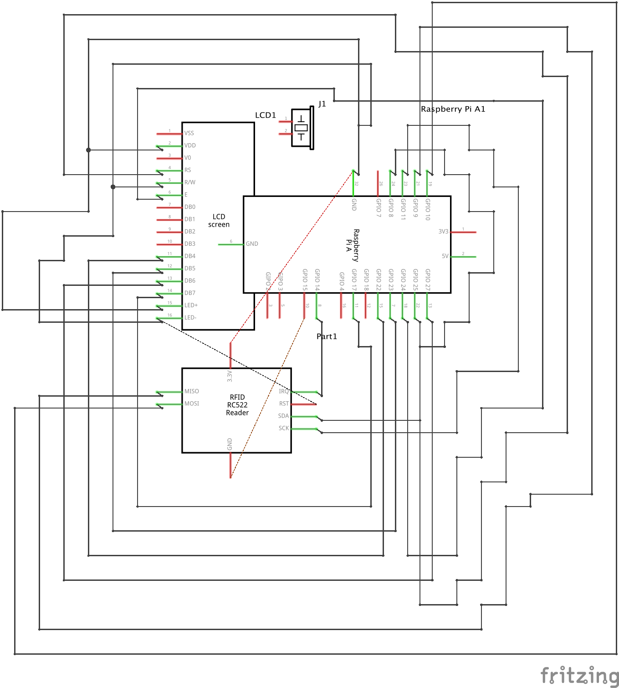
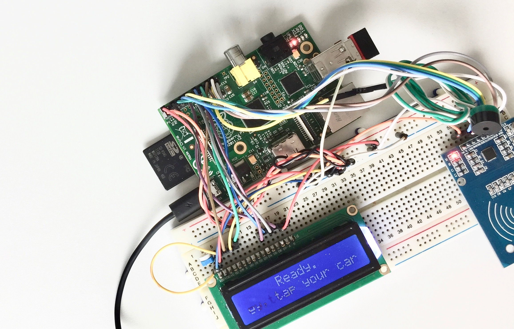
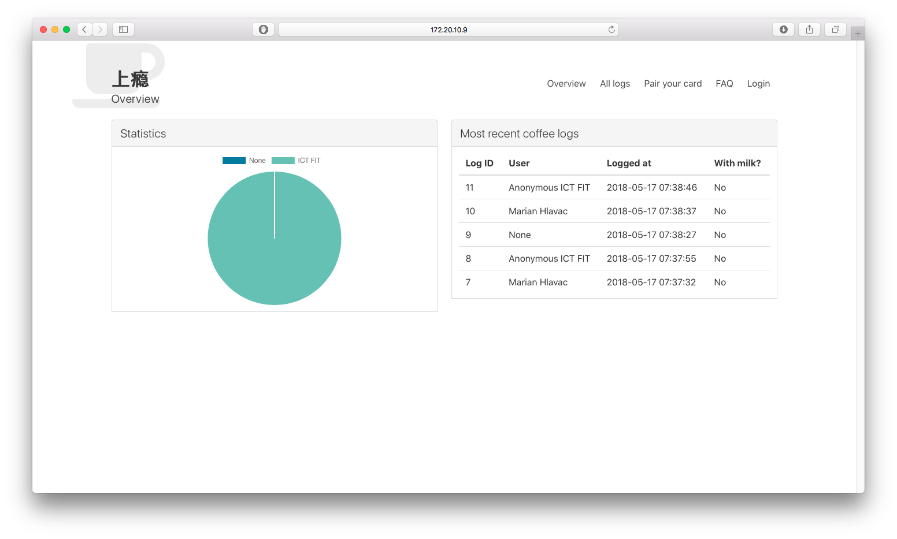

---
header-includes:
    - \usepackage{setspace}
    - \setstretch{1.3}
geometry: "margin=1.5in"
---

# Semestrální práce MI-IOT

Marián Hlaváč  
marian.hlavac@fit.cvut.cz  
MI-IOT letní 2017/18  

## Zadání

Vytvořit přístroj, který bude zaznamenávat spotřebu kávy pomocí RFID karet.
Přístroj bude položen vedle kávovaru a přiblížením kartičky zapíše jedno uvaření kávy.
Kartičky budou spárovány s uživateli a jejich příslušností k oddělení a aplikace
pak vypočítá podíl spotřeby kávy mezi dvěmi (či více) oddělení.

## Hardware

 - Platforma Raspberry Pi
 - Čtečka RFID karet RFID-RC522
 - LCD displej LCD1602
 - tlačítko, piezo speaker
 
## Software

 - Python
 - SQLite

### Použité knihovny

 - CharLCD
 - pirc522
 - RPi.GPIO
 - Flask
 
## Implementace

Implementováno bylo v Pythonu a verzováno nástrojem Git.

Použití knihoven pro komunikaci s RFID čtečkou
a dalšími komponentami - *CharLCD* a *pirc522*. Knihovna *Flask* pro běh webového serveru se statistikami a knihovna *RPi.GPIO* pro komunikaci přes GPIO piny.

Webový server vyžadoval sestavení několika jednoduchých HTML stránek. Použil jsem CSS framework Bulma, aby byl vzhled stránek do určité míry líbivý.

Data jsou ukládány do databáze SQLite3. Nad touto databází lze vytvářet plné SQL queries a díky tomu pracovat velmi rozsáhle s databází.

Bylo tak nutné sestavit SQL schéma pro databázi aplikace a pak napsat jednoduchý set příkazů pro sestavování SQL queries.

Implementace musela být vícevláknová. Samostatně bylo nutné obstarávat jádro aplikace, aktualizaci displeje (text se posouvá při delším textu) a spuštění webového serveru.

## Schéma zapojení

Schéma zapojení lze nalézt ve vektorovém formátu ve složce `doc/`

## Problémy při implementaci

U některých částí (podbalíčků) bylo nutné psát testy, jelikož jsem vyvíjel mimo RPi (RPi bylo v headless módu) a knihovny při spouštění pythonu lokálně hlásily chybu, jelikož periferie (displej a čtečka) nebyly k počítači připojeny, ani nebyly kompatibilní.

Vícevláknovost nebyla pravděpodobně napsána správně, projevuje se dlouhý přístup k databázi, který trvá delší dobu, než by byl uživatel zvyklý (až cca 3 sekund).

Controller displeje je pomalý, přenos znaků na displej není dostatečně rychlý a je znatelný rolling effect. To je však chyba knihovny a úkolem by bylo spíše najít alternativní knihovnu, či knihovnu opravit.

Softwarový PWM, který ovládá malý piezo reproduktor je taktéž pomalý. Tóny jsou zvláštně porušené.

## Výsledek

Výsledkem semestrální práce je zapojený hardware, aplikační jádro pro tento hardware a webová aplikace pro zobrazení výsledků.

Vytisknout 3D krabičku a zapojit HW tlačítko se nepodařilo. Tisk 3D krabičky je časově náročný a přesahoval mimo zadání práce, dále byla má chyba v přepočítání se, a na tlačítko mi již na Raspberry Pi 1 nezbyly volné I/O piny (RPi1 má zkrácený GPIO header).

Podařilo se napsat jednoduchou webové rozhraní zobrazující poslední záznamy o uvařených kávách a rozdělení těchto káv mezi dvě oddělení.

## Možné vylepšení do budoucna

Bylo by vhodné vylepšit web se statistikami a vydolovat z dostupných dat více informací k prezentaci (např. punch cards, globální anonymní statistiky, či individuální statistiky pro každého uživatele)

Aplikace by zasloužila dokončit testy. Většina podbalíčků aplikace nemá dopsány testy, jelikož nebyly vyvíjeny stylem TDD.

Místo softwarového PWM by bylo možné použít HW PWM, který má deska Raspberry Pi dostupný na jednom pinu, který však není z Pythonu jednoduše dostupný pomocí *RPi.GPIO*.

Data také nejsou nikterak zálohována. Bylo by vhodné, kdyby aplikace posílala zálohu dat na nějaký jiný server, aby se data při výpadcích neztratila. Samotná krabička se může poškodit (fyzicky, či může přestat fungovat OS, paměť, či jiná komponenta) a v takovém případě by bylo také vhodné, aby existovala záloha posledních dat.

## Závěr

Semestrální práce splnila základní body zadání, nicméně by jistě zasloužila další rozvin.

Současná práce slouží jako dobrý základ pro dokončení projektu, a zároveň slouží jako rozšířený Proof of Concept celého projektu.

Projekt má reálně použití i možnost reálného nasazení, tudíž bude přes prázdniny dokončen a do kanceláře ke kávovaru skutečně nasazen.

## Zdroje

- How to setup a Raspberry Pi RFID RC522 Chip https://pimylifeup.com/raspberry-pi-rfid-rc522/
- RPi.GPIO 0.5.2a now has software PWM – How to use it http://raspi.tv/2013/rpi-gpio-0-5-2a-now-has-software-pwm-how-to-use-it
- Python RC522 library https://github.com/ondryaso/pi-rc522
- DB-API 2.0 interface for SQLite databases https://docs.python.org/2/library/sqlite3.html
- CharLCD https://github.com/adafruit/Adafruit_Python_CharLCD
- Flask http://flask.pocoo.org
- Bulma Framework https://bulma.io